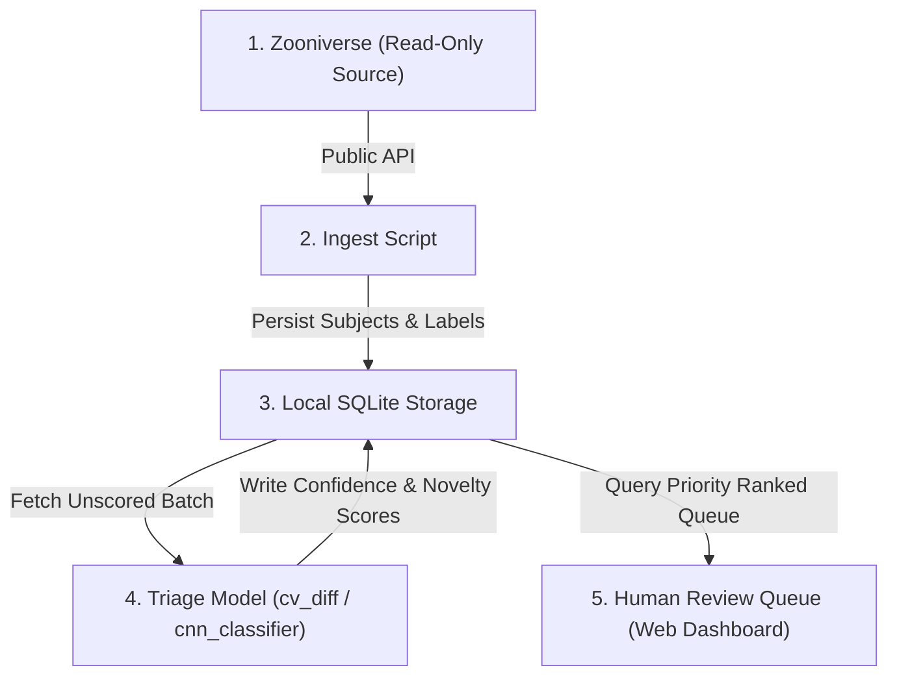

# AstroCAT 🐱🛰️

> **The one-sentence version:** A smart sorting hat that pre-screens NASA's image backlog so a human reviewer spends their limited attention on the most interesting or uncertain images first, instead of clicking through everything in random order.

AstroCAT is a triage companion for NASA/Zooniverse citizen-science projects, built as a local, read-only 5-stage processing pipeline.

---

## 🏗️ Core Architecture: The 5-Stage Pipeline

Data flows strictly downwards through five stages, gets scored, and lands in front of a human at the end — **nothing ever goes back to Zooniverse automatically.**



### 1. Zooniverse — The Source
The source of truth where actual NASA citizen-science projects live (Galaxy Zoo, Active Asteroids, etc.).
- **Read-Only:** AstroCAT never writes or auto-submits anything back to Zooniverse.

### 2. Ingest — Data Fetching
A script reaches out to Zooniverse's public Panoptes API, downloads subject image batches, and pulls existing aggregated human votes (if available).
- Implementation: `src/astrocat/ingest.py` & `scripts/run_ingest.py`

### 3. Storage — Local Per-Project DB
Everything is saved into one self-contained local SQLite file per project (`data/<project_slug>/storage.db`). Think of it as a spreadsheet with three tabs:
- **`subjects`**: Raw subject IDs, image file paths, metadata
- **`labels`**: Aggregated human vote labels & consensus scores
- **`scores`**: AstroCAT model predictions, confidence, and novelty scores
- Implementation: `src/astrocat/storage.py`

### 4. Triage Model — Smart Scoring
Depending on the project type, AstroCAT runs one of two smart scoring strategies:
- **Image Pair Comparison (`cv_diff`)**: Compares reference and moving frames using ORB alignment & difference contour analysis (best for moving asteroids, comet tails).
- **Single Image Classifier (`cnn_classifier`)**: ResNet18 transfer learning classifier guessing categories and flagging low-confidence items (best for galaxy mergers, feature detection).
- Implementation: `src/astrocat/models/` & `src/astrocat/triage.py`

### 5. Review Queue — Human Priority Dashboard
Model scores get sorted in SQLite so that the weirdest/least-confident/novel items land at the top of the queue. A human opens a simple web dashboard to inspect the ranked list and make final calls.
- Implementation: `src/astrocat/dashboard/` & `scripts/run_pipeline.py --serve`

---

## 🚀 Quickstart

### 1. Run the Full 5-Stage Pipeline CLI
```bash
python scripts/run_pipeline.py --project active-asteroids --max-subjects 50
```

### 2. Run Pipeline & Launch Human Review Dashboard
```bash
python scripts/run_pipeline.py --project active-asteroids --serve --port 5000
```
Open http://127.0.0.1:5000 in your browser to view the priority triage queue.

### 3. Test Single Stage Scripts
```bash
# Ingest Stage
python scripts/run_ingest.py --project galaxy-zoo --max-subjects 20

# Triage Stage
python scripts/run_triage.py --project galaxy-zoo
```

---

## 🧪 Running Tests

```bash
pytest
```

---

## 🗺️ AstroCAT Roadmap

### Phase 0 — Scaffold (done)
- [x] Repo structure, config system, SQLite storage layer
- [x] Panoptes ingest (subjects + aggregated-label CSV import)
- [x] Shared OpenCV preprocessing (resize, denoise, ORB-based alignment)
- [x] `cv_diff` model — classical change/blob detection, no training needed
- [x] `cnn_classifier` model — trainable ResNet18 classifier
- [x] Triage scoring pipeline + SQLite queue
- [x] Local Flask review dashboard
- [x] End-to-end 5-stage pipeline runner CLI (`run_pipeline.py`)

### Phase 1 — Prove it on one project
- [ ] Choose first target: **Active Asteroids** for `cv_diff` or **Galaxy Zoo** for `cnn_classifier`
- [ ] Pull a real batch of subjects + existing aggregated labels via `ingest.py`
- [ ] Run triage, manually review 50–100 queue items
- [ ] Measure precision/recall vs. aggregated volunteer consensus

### Phase 2 — Harden the core
- [x] Per-project unit test suite (`tests/`)
- [ ] Add basic logging/metrics
- [ ] Rate-limit-friendly ingest batching
- [ ] Installable package (`pip install -e .`)

### Phase 3 — Expand project coverage
- [ ] Second `cv_diff` project
- [ ] Second `cnn_classifier` project
- [ ] Custom preprocessing hooks

### Phase 4 — Useful Review Loop
- [ ] Dashboard manual override (mark reviewed/confirmed/rejected locally)
- [ ] Active-learning loop for model retraining
- [ ] Side-by-side frame diff viewer

### Phase 5 — Research Team Outreach
- [ ] Contact project research teams with honest performance results

---

## ⛔ Non-goals (Explicitly Out of Scope)
- Auto-submitting classifications back into Zooniverse on AstroCAT's own authority.
- Scraping raw individual volunteer votes (only published aggregated consensus data is used).
- Running as a public multi-user hosted cloud service (remains a local triage tool).