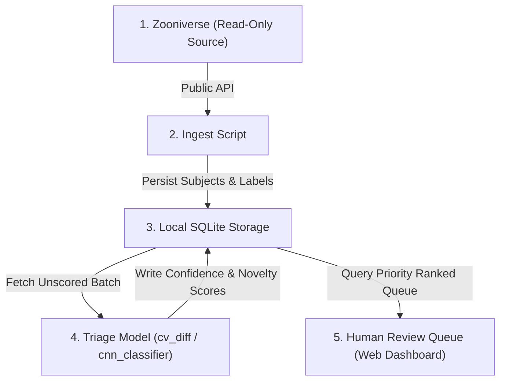

# AstroCAT Roadmap

AstroCAT is a triage companion for NASA/Zooniverse citizen-science projects, built as a local, read-only 5-stage processing pipeline.

---

## 🏗️ Core Architecture: The 5-Stage Pipeline

Data flows strictly downwards through five stages, gets scored, and lands in front of a human at the end — **nothing ever goes back to Zooniverse automatically.**




### 1. Zooniverse — The Source
The source of truth where actual NASA citizen-science projects live (Galaxy Zoo, Active Asteroids, etc.).
- **Read-Only:** AstroCAT never writes or auto-submits anything back to Zooniverse.

### 2. Ingest — Data Fetching
A script reaches out to Zooniverse's public Panoptes API, downloads subject image batches, and pulls existing aggregated human votes (if available).
- Implementation: `src/astrocat/ingest.py` & `scripts/run_ingest.py`

### 3. Storage — Local Per-Project DB
Everything is saved into one self-contained local SQLite file per project (`data/<project_slug>/storage.db`). Think of it as a spreadsheet with three tabs:
- **`subjects`**: Raw subject IDs, image file paths, metadata
- **`labels`**: Aggregated human vote labels & consensus scores
- **`scores`**: AstroCAT model predictions, confidence, and novelty scores
- Implementation: `src/astrocat/storage.py`

### 4. Triage Model — Smart Scoring
Depending on the project type, AstroCAT runs one of two smart scoring strategies:
- **Image Pair Comparison (`cv_diff`)**: Compares reference and moving frames using ORB alignment & difference contour analysis (best for moving asteroids, comet tails).
- **Single Image Classifier (`cnn_classifier`)**: ResNet18 transfer learning classifier guessing categories and flagging low-confidence items (best for galaxy mergers, feature detection).
- Implementation: `src/astrocat/models/` & `src/astrocat/triage.py`

### 5. Review Queue — Human Priority Dashboard
Model scores get sorted in SQLite so that the weirdest/least-confident/novel items land at the top of the queue. A human opens a simple web dashboard to inspect the ranked list and make final calls.
- Implementation: `src/astrocat/dashboard/` & `scripts/run_pipeline.py --serve`

---

## 🚀 Quickstart

### 1. Run the Full 5-Stage Pipeline CLI
```bash
python scripts/run_pipeline.py --project active-asteroids --max-subjects 50
```

### 2. Run Pipeline & Launch Human Review Dashboard
```bash
python scripts/run_pipeline.py --project active-asteroids --serve --port 5000
```
Open http://127.0.0.1:5000 in your browser to view the priority triage queue.

### 3. Test Single Stage Scripts
```bash
# Ingest Stage
python scripts/run_ingest.py --project galaxy-zoo --max-subjects 20

# Triage Stage
python scripts/run_triage.py --project galaxy-zoo
```

---

## 🧪 Running Tests

```bash
pytest
```

---

## 🗺️ AstroCAT Roadmap

### Phase 0 — Scaffold (done)
- [x] Repo structure, config system, SQLite storage layer
- [x] Panoptes ingest (subjects + aggregated-label CSV import)
- [x] Shared OpenCV preprocessing (resize, denoise, ORB-based alignment)
- [x] `cv_diff` model — classical change/blob detection, no training needed
- [x] `cnn_classifier` model — trainable ResNet18 stub
- [x] Triage scoring pipeline + SQLite queue
- [x] Local Flask review dashboard

**Exit criteria:** `run_ingest.py` → `run_triage.py` → dashboard works end-to-end on at least one project with synthetic/sample data.

---

## Phase 1 — Prove it on one project

Pick **one** project and get a real, honest result before touching anything else.

- [ ] Choose first target: recommend **Active Asteroids** or **Backyard Worlds** for `cv_diff` (no training data needed, fastest to a real result), or **Galaxy Zoo** for `cnn_classifier` (most existing labeled data to train against)
- [ ] Pull a real batch of subjects + existing aggregated labels via `ingest.py`
- [ ] Run triage, manually review 50–100 queue items yourself
- [ ] Measure against ground truth:
  - Precision/recall vs. aggregated volunteer consensus
  - How often "flagged novel" items were actually the interesting/ambiguous ones
- [ ] Write down honest failure modes (where does `cv_diff`/CNN clearly get it wrong?)

**Exit criteria:** a short writeup — "on N subjects, AstroCAT's queue put X% of true-positive/interesting cases in the top 20%." If this isn't true, the tool isn't ready to show anyone yet — iterate on the model before moving on.

---

## Phase 2 — Harden the core

- [ ] Add per-project unit tests (`tests/`) — at minimum: storage round-trip, one model's `predict()` on a fixed sample image with a known expected range
- [ ] Add basic logging/metrics: subjects ingested, subjects scored, queue size, novel-flag rate — so drift is visible over time
- [ ] Add a config validation step (`scripts/validate_config.py`) so a bad `projects.yaml` entry fails loudly, not silently
- [ ] Add rate-limit-friendly ingest (batching + backoff) so a large project pull doesn't hammer the API
- [ ] Package as installable (`pip install -e .`) instead of path-hacking

**Exit criteria:** someone else can clone the repo, run `pip install -e .`, and get a working queue for the Phase 1 project in under 10 minutes.

---

## Phase 3 — Expand project coverage

Add projects one at a time, in this order of effort (easiest first):

- [ ] Second `cv_diff` project (reuse everything from Phase 1's project)
- [ ] Second `cnn_classifier` project — this is where you'll find out if the abstraction actually holds or needs per-project preprocessing hooks
- [ ] Add a project needing custom preprocessing (e.g. JunoCam-style non-standard optics) — extend `preprocess.py` rather than forking model code
- [ ] Document the "add a new project" steps in README based on what actually broke doing this

**Exit criteria:** 3–4 projects running through the same pipeline with only config + a preprocessing hook changed, no per-project forks of core logic.

---

## Phase 4 — Make review genuinely useful, not just a queue

- [ ] Add manual override in the dashboard: mark a queue item reviewed/confirmed/rejected (local-only, feeds back into your own eval, not Zooniverse)
- [ ] Add simple active-learning loop: reviewed items get added to the CNN training set, model retrains periodically
- [ ] Add image comparison view for `cv_diff` projects (show reference + moving frame side by side, not just the diff result)
- [ ] Add basic auth if you ever run this somewhere other than localhost

**Exit criteria:** the dashboard is something you'd actually keep using yourself, not just a demo.

---

## Phase 5 — Reach out (only if Phase 1–4 produced something real)

This phase is people, not code. Don't start it until you have a working
tool and an honest performance writeup — a demo alone isn't enough to
ask a research team to look at.

- [ ] Identify the project's research team via its Zooniverse "About" page or NASA's [Researcher Resources](https://science.nasa.gov/citizen-science/resources/) page
- [ ] Prepare a short, concrete pitch: what AstroCAT found, what it got wrong, what it would take to try it on their backlog
- [ ] Contact them — treat this as "asking to contribute," not "here's my integration," since it's their data, their publication, their call
- [ ] If there's interest: whatever comes next (data access, joint eval, code review) is defined by them, not this roadmap

**Exit criteria:** N/A — this phase ends wherever the conversation with the actual team leads.

---

## Non-goals (explicitly out of scope)

- Auto-submitting classifications into Zooniverse on AstroCAT's own authority — against most projects' Terms of Use and undermines the statistical basis of their results
- Scraping or storing raw individual volunteer votes — only already-published aggregated results are used
- Running as a public multi-user hosted service — this stays a local/personal tool unless a project team decides otherwise in Phase 5